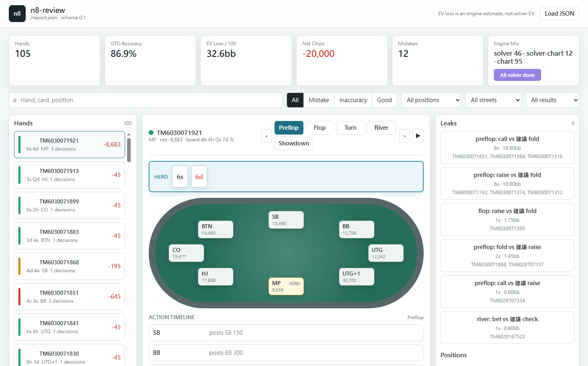
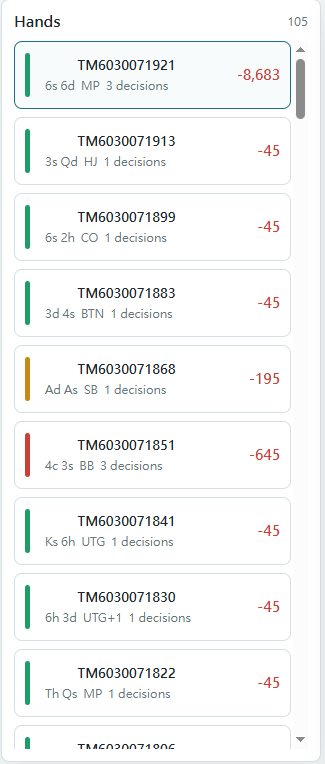
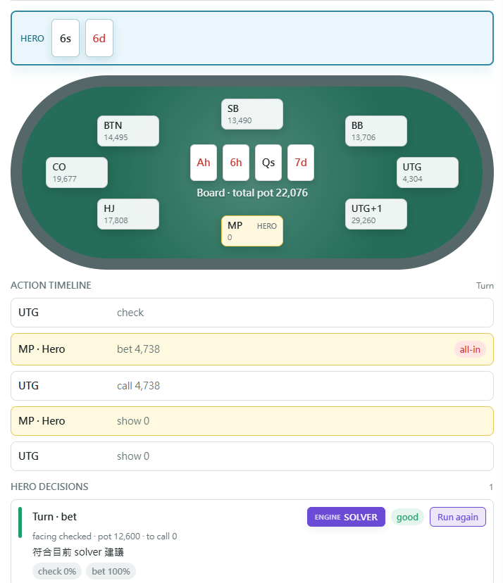
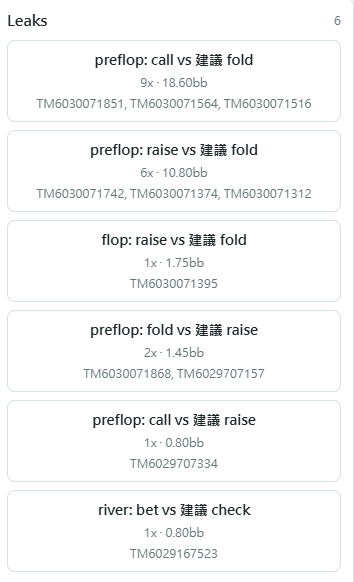
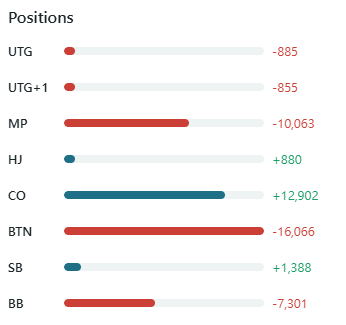

# n8-review

[English](../../README.md) | [繁體中文](README.zh-TW.md) | **简体中文**

<p align="center">
  
  
  
  
  
  
  
  
</p>

> 像国际象棋引擎一样复盘你的扑克手牌 —— 逐手、逐决策，用 GTO 为你的每一步标注颜色。

**n8-review** 读取 Natural8 / GGPoker 锦标赛导出的手牌历史，从 **你本人（Hero）** 的视角，把每个决策标成 🟢 可接受 / 🟡 不准 / 🔴 失误，并附上 GTO 建议与理由。看完一场，你会清楚知道「我哪几手打错、错在哪、该怎么打」。

<p align="center">
  
</p>

---

## ✅ 支持范围

| 来源 / 类型 | 支持 |
|---|---|
| **Natural8 / GGPoker 锦标赛（MTT）** | ✅ 支持 |
| 其他 GG 网络 skin 的锦标赛 | ✅ 多半可用（同一套手牌历史格式） |
| 其他扑克室（PokerStars、888、partypoker…） | ❌ 尚未支持（手牌历史格式不同） |
| 现金局（cash game） | ❌ 尚未支持（目前只解析锦标赛标头） |

> 简单说：**目前只吃 Natural8 / GGPoker 的锦标赛手牌历史**。丢其他扑克室或现金局的文件会解析不到。

---

## ✨ 特色

- **🎯 逐决策 GTO 评分** — 每手列出 Hero 的每个决策点，依偏离 GTO 的 EV 损失标注颜色。
- **📊 统计报表** — GTO 准确率、每百手 EV 损失、VPIP / PFR / 3Bet / C-bet、各位置盈亏。
- **👥 对手画像** — 聚合重复对手的倾向、产生剥削建议，并回馈给翻后 equity 计算。
- **🖥️ Web UI** — 交互式逐手回放，零后端、零构建，打开即用。
- **🔌 可插拔 solver** — 默认用轻量 equity/EV 估计；关键手可接外部 CFR solver 深解。

---

## 🚀 快速开始

### 1. 安装

```powershell
python -m venv .venv
.venv\Scripts\activate
pip install -e .
```

### 2. 分析你的手牌

把 n8 导出的 `.txt` 放进一个文件夹（示例见 `data/`），然后：

```powershell
n8-review analyze ".\data" --json report.json
```

终端会立刻打印彩色的逐手复盘与统计，同时生成一份 `report.json`。

> 还没有自己的手牌？repo 内附合成示例 `data/sample.txt`，可直接试跑：`n8-review analyze data/sample.txt`。

### 3. 用 Web UI 交互查看

```powershell
n8-review web --report report.json
```

打开终端打印的网址（默认 http://127.0.0.1:8765/），就能逐手回放、按位置/街/结果筛选，并查看漏洞与对手画像。

> 不想开 server？也可以直接用浏览器打开 `web/index.html`，再手动加载 `report.json`。

---

## 📸 界面导览

> 下列截图带你快速看懂 Web UI（最上方主图是完整界面总览；点任一张可放大）。

<table>
<tr>
<td width="50%" align="center"><b>① 手牌列表 Hand list</b><br><sub>逐手 ID／底牌／位置／净利，以 🟢🟡🔴 标示失误等级</sub><br></td>
<td width="50%" align="center"><b>② 逐手回放 Hand replay</b><br><sub>牌桌＋动作时间轴＋决策评分卡（GTO／solver 建议）</sub><br></td>
</tr>
<tr>
<td width="50%" align="center"><b>③ 漏洞 Leaks</b><br><sub>重复失误模式：次数、累计 EV 损失、对应手牌</sub><br></td>
<td width="50%" align="center"><b>④ 各位置盈亏 Positions</b><br><sub>各位置净输赢，看哪个位置在漏钱</sub><br></td>
</tr>
</table>

---

## 📖 命令一览

| 命令 | 用途 |
|---|---|
| `n8-review analyze <路径>` | 逐手彩色复盘 + 统计 + 漏洞；加 `--json report.json` 导出给 Web UI |
| `n8-review hand <文件> --id <手牌ID>` | 单手逐街深度复盘 |
| `n8-review stats <路径>` | 只看统计指标 |
| `n8-review profile <路径>` | 对手画像（VPIP / PFR / 3Bet / 标签） |
| `n8-review web --report report.json` | 启动 Web UI 本地 server |

**常用选项**

```powershell
n8-review analyze ".\data" --hero "Hero"          # 指定 Hero 名称（默认 "Hero"）
n8-review analyze ".\data" --min-tier inaccuracy  # 只显示不准以上的手
n8-review hand ".\data\xxx.txt" --id TM6030071921 --postflop solver --solver-path C:\path\solver.exe
```

`<路径>` 可以是单一 `.txt` 文件，也可以是装满手牌文件的文件夹。

---

## 🧠 工作原理

```
.txt ─▶ 解析 ─▶ Hero 视角衍生 ─▶ 逐决策 GTO 评分 ─▶ 报表 / Web UI
                （位置/筹码/M）   ├ 翻前：GTO 范围表查表
                                 └ 翻后：equity 估计（默认）或 CFR solver（选用）
```

- **翻前** 比对预存的 GTO 范围表（各位置 open / 3bet / call、短筹码 push/fold），是真正的 GTO、离线又快。
- **翻后** 用 equity vs 对手范围 + EV 启发法可靠标出「明显失误」；想对关键手做真 solver 深解，再接上外部 adapter。

Solver adapter 的 JSON 契约见 [`docs/SOLVER_ADAPTER.md`](../SOLVER_ADAPTER.md)。

---

## 📁 项目结构

```
poker-hand-review/
├── src/n8_review/      核心引擎
│   ├── parser/         手牌历史文本解析
│   ├── enrich/         Hero 视角衍生（位置、有效筹码、决策节点）
│   ├── gto/            翻前 GTO 范围表
│   ├── evaluate/       逐决策评分 + 可插拔翻后后端
│   ├── analysis/       equity / 统计 / 漏洞聚合
│   ├── profile/        对手画像
│   └── report/         CLI 彩色输出 + JSON 导出
├── web/                静态 Web UI（SPA）
├── docs/               solver adapter 契约文档
├── data/               示例手牌历史
└── tests/              测试
```

---

## 🔬 进阶（选用）：接真 solver

**一般使用不需要安装任何 solver** —— 默认的 equity 后端就能标出明显失误。

若你想对关键手做真正的 CFR 深解，可以接上 [TexasSolver](https://github.com/bupticybee/TexasSolver)：

1. 下载 TexasSolver 的 `console_solver`（Windows 发布包已内含，免自行编译）。
2. 设置它的路径：`$env:TEXAS_SOLVER_CONSOLE = "C:\TexasSolver\console_solver.exe"`
3. 用内置启动器跑：
   ```powershell
   n8-review hand ".\data\xxx.txt" --id TM123 --postflop solver --solver-path .\validation\texassolver.cmd
   ```

完整设置、调校参数与模型假设见 [`docs/SOLVER_ADAPTER.md`](../SOLVER_ADAPTER.md)。

---

## ⚠️ 关于 EV 估计

未使用 solver 时，`ev_loss_bb` 是引擎的**估计值**（来自图表 / equity 启发法），请当作**严重度指引**，不是精确的 solver EV。要精确数字，请对该手用 `--postflop solver` 接上 solver adapter。

---

## 🛠️ 开发

```powershell
pip install -e ".[dev]"   # 安装开发依赖（pytest / ruff / mypy）
pytest                    # 测试
ruff check src tests      # lint
mypy src                  # 类型检查
```

需求：Python 3.11+。

---

## 🤝 贡献

欢迎 issue 与 PR！提交前请先读过这几点，能让 review 更顺：

**动手前**

- 较大的改动建议**先开 issue 对齐方向**，再动手实现。

**写代码时**（详见 [`CLAUDE.md`](../../CLAUDE.md)）

- **保持简单** —— 用最少的代码解决问题，不做没被要求的抽象或配置弹性。
- **外科手术式修改** —— 只动你必须动的，不顺手重构或重排相邻代码；配合既有风格。
- **解析器的容忍原则不可破坏** —— 已知 token 严格解析，未知行进 `raw_unparsed` 警告但不中断。
- 注释**中英文皆可**，配合周围既有风格即可。

**提交前**

```powershell
pytest                 # 测试要绿
ruff check src tests   # lint 要过
mypy src               # 类型检查（strict）要过
```

- 改到评分、解析或导出逻辑时，顺手补一个能复现/验证的测试。
- 一个 PR 专注一件事；commit 信息写清楚「改了什么、为什么」。

> 提醒：请只编辑 `CLAUDE.md`，`AGENTS.md` 会由 hook 自动同步。

---

## 📌 状态

核心流程（M1–M7）已完成：解析、Hero 视角衍生、equity 后端、翻前评分、统计 / 漏洞 / 画像、JSON 导出、Web UI，以及选用的外部 solver adapter。

---

## 📄 许可

MIT License — 详见 [`LICENSE`](../../LICENSE)。
